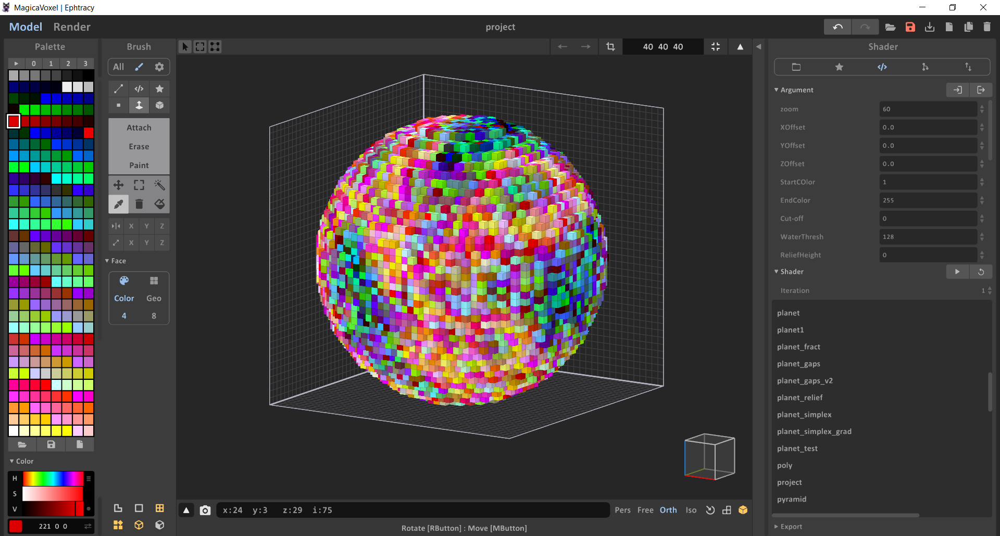
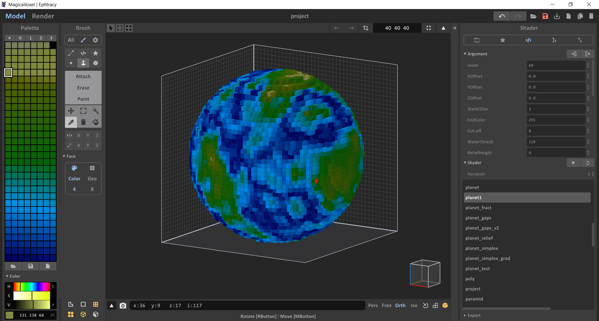
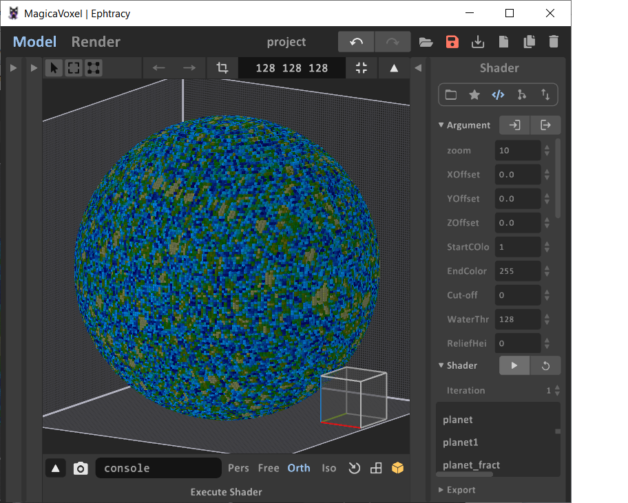
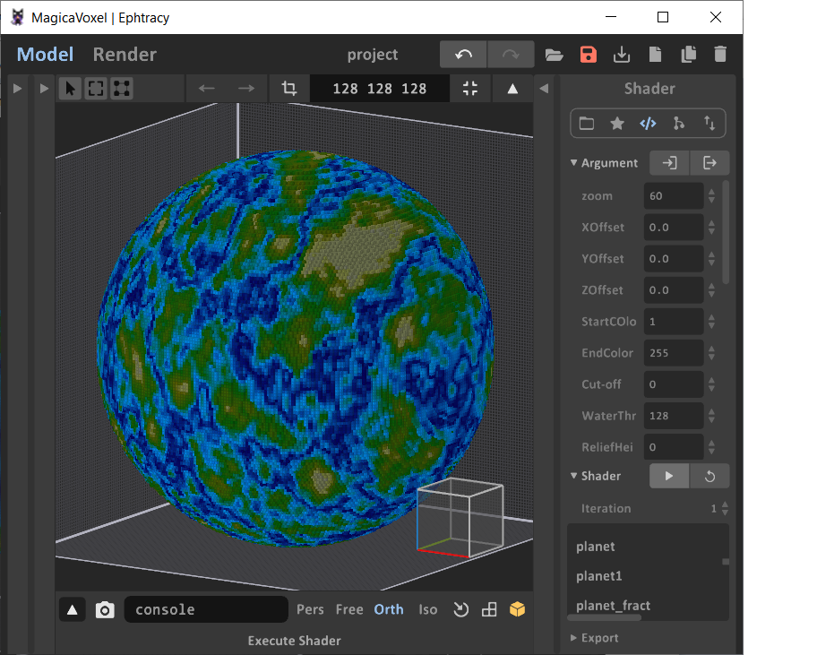
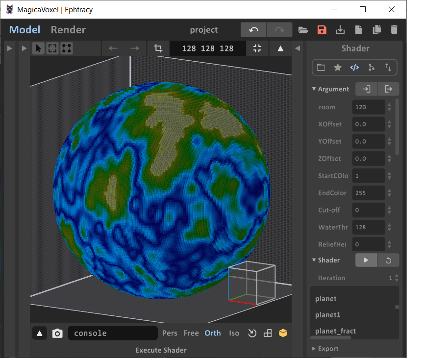
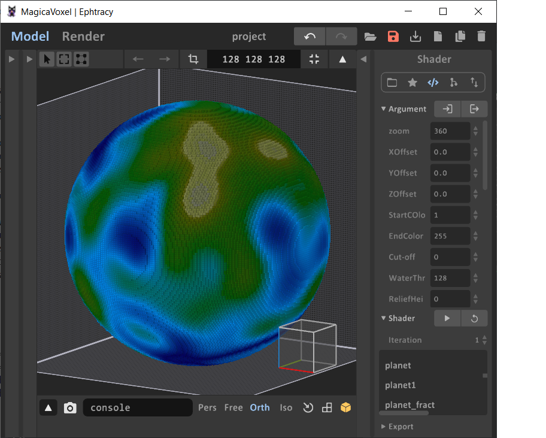

# MagicaVoxelPlanetShader
 A Magicavoxel shader that can be used to create interesting sphere-shaped objects

##  Getting Started
After seelctinbg the shader, you will see a result that looks something like this:

[Default Planet and Palette](

This looks like a mess because the default palette is fairly erratic.  You can create your own pallete,or load one of the ones provided in this repo.

## Parameters

| Parameter         | Descruotuib|
| ---               | ---       |
| Zoom              | Determines scale of our noise.  Smaller values is more 'zoomed out', larger more 'zoomed in'  |
| X/Y/Z Offset      | Translation of our noise.  You can use this to 'move' around int he noise. |
| StartColor        | Our first color indext to use to color our planet. |
| EndCOlor          | Last index to use for our planet. |
| Cut-off           | If > 0, any voxels with a color index above this value will be removed from the model.   This can be used ot make more abstract models. |
| WaterThresh       | Used for ReliefHeight.  If set, colors below this value are considered 'water' and will be removed from the layers reserved for relief height | | 
| ReliefHeight      | How may voxels of projection you want. Any colors below WaterThresh will be removed for this many layers.|

| RemoveColor       | Use this to remove voxels with the given index.  Useful for creating cavernous structures, along with Cut-off. |

| Octaves           | Determines how many iterations of noise to apply to our noise values.   Increaasing this will make the result look more rough, decreasing will make things look more uniform. |
| OctaveMultiple    | Changes how much the results change in each octave.  Increaseing this will make edges look more noisy. |
| Amplitude         | Scales the results of the noise.   This can incase/reduce the peaks/troughs of the noise |
| AmplitudeMultiple | The amount which the amplitude increases with each octave.  This can dampen/enhance the effects of the amplutide over each octave. |
| RemapType         | 0 will eliminate negative index colors from the noise values.   1 will allow negative noise values (which will just be mapped to the 1st color) |

## Zoom

Zoom set to 10, 60, 120,and 360

