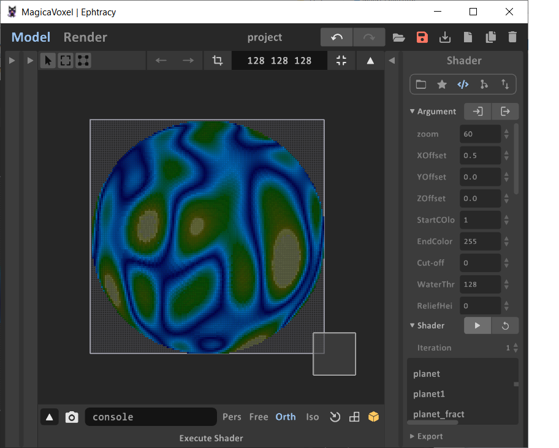

# MagicaVoxelPlanetShader

 A MagicaVoxel shader that can be used to create interesting sphere-shaped objects.  It is a compute shader based off of various other shaders from people smarter than I.  It uses simplex noise found on the web.  I cobbled it together to help create intresting planet-looking structures during a game jam and decided to make it available to other people who are much more artistic than I.

If you make something pretty with this, please send me something to my gmail!   mrbiggles7719 is my username.

## Installation
Simply put the planet1.txt file in your MagicaVoxel shaders directory, and put copy the pallettes to someplace where you can load them. 

##  Getting Started

After seelctinbg the shader, you will see a result that looks something like this:

This looks like a mess because the default palette is fairly erratic.  You can create your own pallete,or load one of the ones provided in this repo.

I have more examples of what you can do with this shader here:

[MrBiggles ArtStation](https://mrbiggles7719.artstation.com/projects/189KNZ)

## Parameters

| Parameter         | Description |
| ---               | ---       |
| Zoom              | Determines scale of our noise.  Smaller values is more 'zoomed out', larger more 'zoomed in'  |
| X/Y/Z Offset      | Translation of our noise.  You can use this to 'move' around int he noise. |
| StartColor        | Our first color indext to use to color our planet. |
| EndCOlor          | Last index to use for our planet. |
| Cut-off           | If > 0, any voxels with a color index above this value will be removed from the model.   This can be used ot make more abstract models. |
| WaterThresh       | Used for ReliefHeight.  If set, colors below this value are considered 'water' and will be removed from the layers reserved for relief height | | 
| ReliefHeight      | How may voxels of projection you want. Any colors below WaterThresh will be removed for this many layers.|
| RemoveColor       | Use this to remove voxels with the given index.  Useful for creating cavernous structures, along with Cut-off. |
| Octaves           | Determines how many iterations of noise to apply to our noise values.   Increaasing this will make the result look more rough, decreasing will make things look more uniform. |
| OctaveMultiple    | Changes how much the results change in each octave.  Increaseing this will make edges look more noisy. |
| Amplitude         | Scales the results of the noise.   This can incase/reduce the peaks/troughs of the noise |
| AmplitudeMultiple | The amount which the amplitude increases with each octave.  This can dampen/enhance the effects of the amplutide over each octave. |
| RemapType         | 0 will eliminate negative index colors from the noise values.   1 will allow negative noise values (which will just be mapped to the 1st color) |

## Zoom

Zoom set to 10, 60, 120,and 360

## X/Y/Z Offset 

You can pan the resulting noise by adjusting these values.   The following examples show the X offset at 0.0, 0.1, and 0.5:

## StartColor

Startcolor set to 1 and 30:

## EndColor

EndColor set to 30 and 120:

## Cut-off

This value can be used to create eroded/cavernous structures.

The following are cut-off values of 0 (default), 33, and 128:

## Relief
Along with WaterThresh, this can be used to add a bit of releif to the model.   This method simply removes 'water' from the upper layers, so it can make the 'land' look like it's tpaered out if it's too  high.

## WaterThresh

The following are examples of setting waterthresh to 1, 60, and 120:

## RemoveColor

Selectively remove a single color.   The following are examples where we have no removeal and one with the 2nd index removed (out of 5 total colors):

## Octaves

Octaves are the noise function applied to itself.  More octaves will produce a more complex contour.  

## OctaveMultiplier

This multiplier influnces the input of the noise function.  Each octave the values passed to the noise function are multiplied by this value.  Reducing this value can give you more simple contours as well.

## Amplitude

This influnces the height of the noise waves. The following are amplitudes set to 0.1, 0.2, 0.3, 0.5, and 1.0, respectively:

## AmplitudeMultiplier

This influences the influence of the amplitude for each octave.  The following are values of 0.1, 0.2, 0.3, 0.5, and 1.0, respectively:

